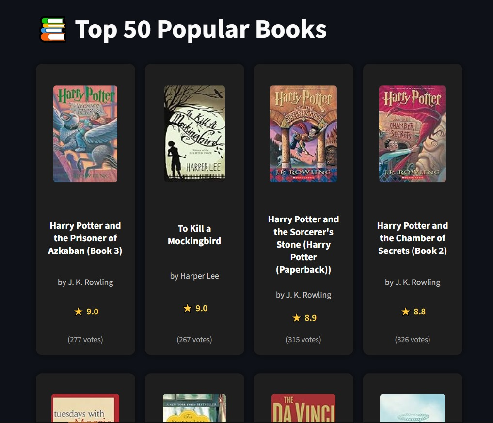

# 📚 Book Recommendation System

A machine learning-powered book recommendation system using collaborative filtering (cosine similarity). It analyzes user ratings and suggests books similar to the one you love!

  
   
  <em>Top 50 Most Popular Books Based on User Ratings</em>

---

## 🚀 Features

- 📊 Filters users who rated more than 200 books
- 🔎 Filters books with at least 50 ratings
- 📈 Recommends top 10 similar books using cosine similarity
- 🎨 Clean data visualizations and a beautiful layout

---

## 📁 Dataset Used

The system uses three main datasets:

- `books.csv` – Metadata of books (title, author, image, etc.)
- `users.csv` – User information
- `ratings.csv` – User ratings for books

---

## 📌 How It Works

1. Cleans the dataset: removes missing values, filters useful users and books
2. Merges ratings with book metadata
3. Builds a **user-book matrix**
4. Computes **cosine similarity** between books
5. Recommends similar books to the selected one

---

🧑‍💻 Author
Made with ❤️ by Faizan Aijaz

